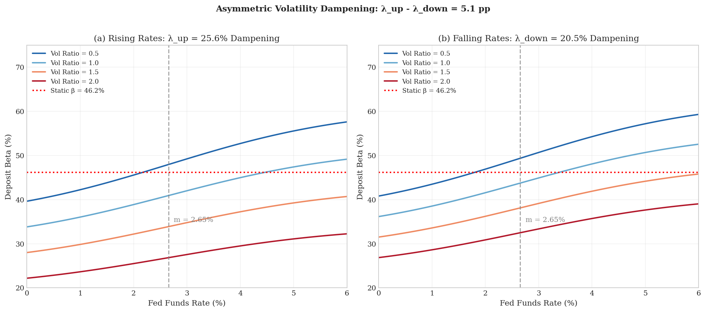
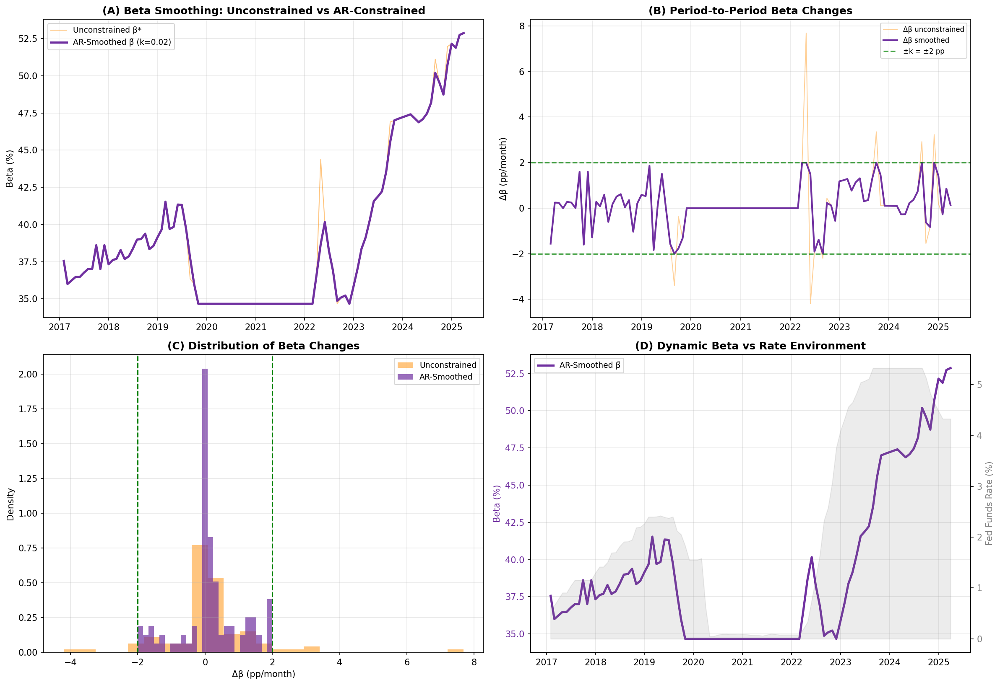
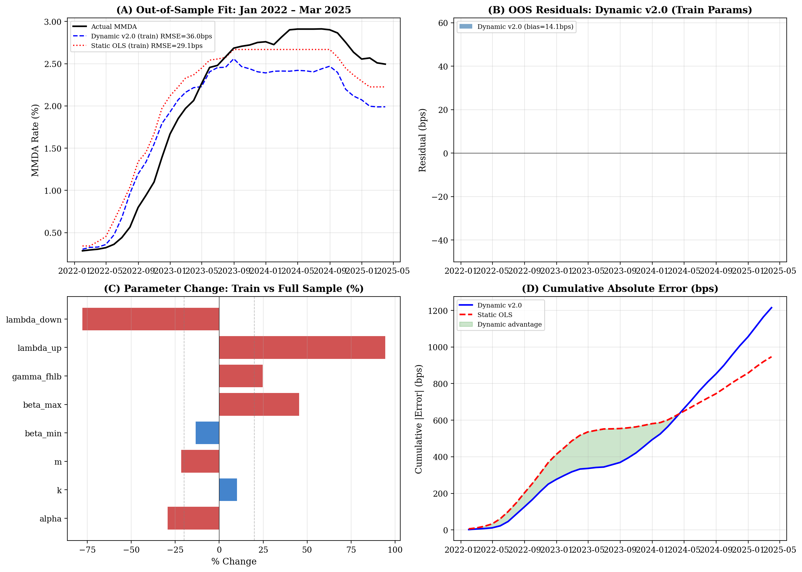
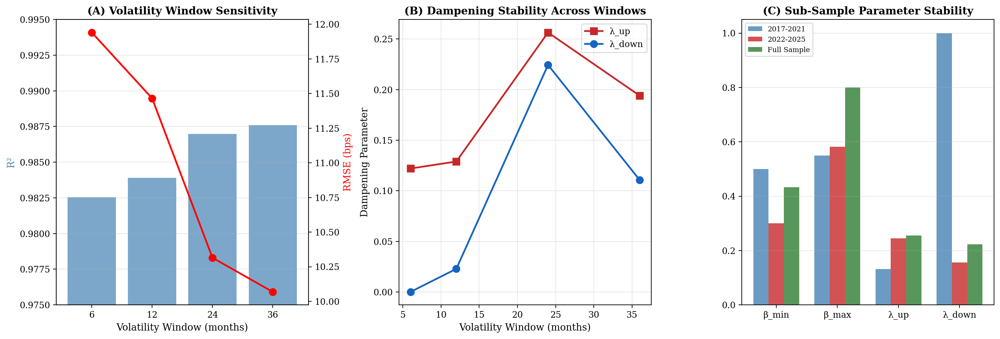
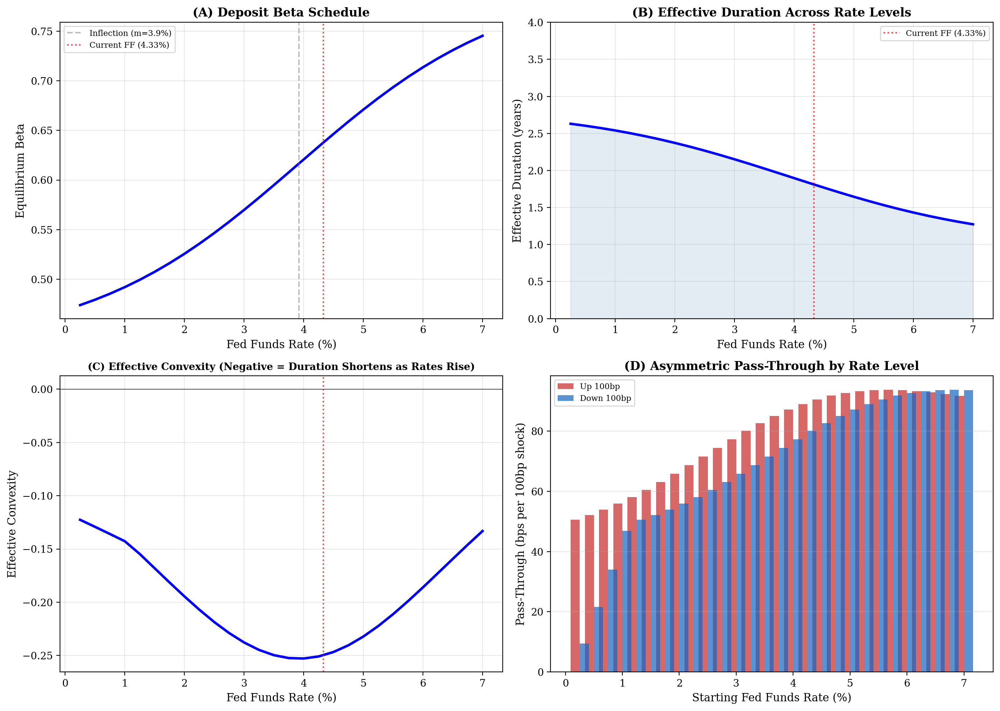
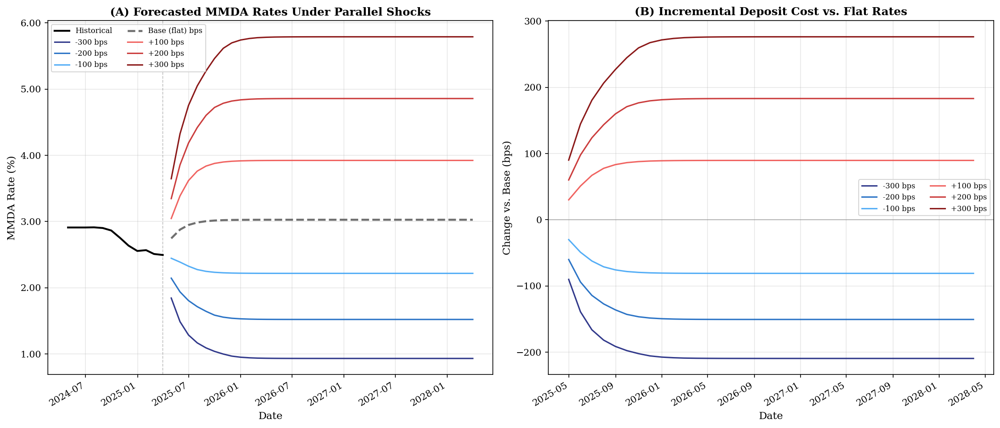
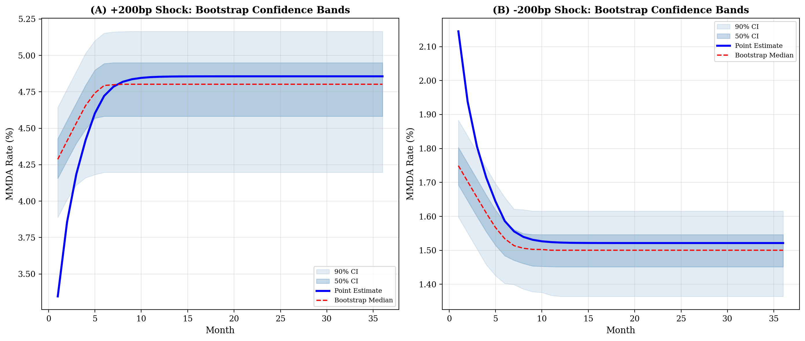
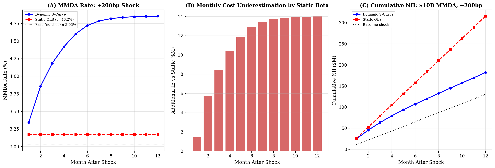

# Dynamic Deposit Betas: An Asymmetric Volatility-Adjusted S-Curve Framework for MMDA Rate Sensitivity

**Chih L. Chen, BTRM, CFA, FRM**  
*Asset Liability Management / Treasury*  

**February 2026**

---

## Abstract

Standard deposit beta models assume banks reprice deposits at a constant rate regardless of the interest rate environment. The Fed's 2022–2025 tightening cycle exposed the limitations of that assumption.

This paper develops a dynamic beta framework for money market deposit accounts that captures what practitioners already know but rarely formalize: deposit competition intensifies as rates rise, and banks respond to volatility differently depending on whether rates are going up or coming down. The model uses a logistic S-curve to let deposit sensitivity evolve with rate levels, a volatility dampening mechanism that accounts for reduced pass-through during uncertain environments, and an autoregressive smoothing constraint that prevents implausible month-to-month beta jumps. Standard errors are computed using a Huber-White sandwich estimator with Newey-West HAC weighting, properly accounting for the serial dependence inherent in monthly financial data.

The core empirical finding is **asymmetric volatility dampening**: banks suppress competitive repricing by 25.5% when rates are rising under elevated volatility, but only 22.3% when rates are falling. The data reject the symmetric restriction at $p < 0.001$. Using monthly data from January 2017 through March 2025 ($n = 99$), the model achieves an in-sample $R^2$ of 0.987 and RMSE of 10.3 basis points. Scenario analysis with a Nerlove partial adjustment filter ($\theta = 0.47$) shows that roughly half the gap between the current deposit rate and its model-implied equilibrium closes each month, with full convergence within 12 months. A +200bp shock produces 22% more deposit cost pass-through than a -200bp shock, a structural asymmetry driven by the S-curve's concavity near the current rate level.

For practitioners, the paper provides effective duration schedules showing that MMDA duration declines from 2.5 years in a 1% rate environment to 1.4 years at 6%, a worked portfolio example quantifying the dollar impact on a $10 billion deposit book, and an implementation checklist for embedding the model in ALM systems. The complete code and data are publicly available.

**Keywords:** deposit beta, interest rate risk, asset-liability management, money market deposits, monetary policy transmission, IRRBB, effective duration, non-maturity deposits

**JEL Classification:** G21, E43, E52, C22

---

## 1. Introduction

Most ALM teams treat the deposit beta as a fixed input. Pick 50% or 60%, apply it uniformly across the MMDA portfolio, and move on. That number does not change with the rate environment, the direction of rate moves, or the level of market uncertainty.

The 2022-2023 tightening cycle showed why this approach fails. The federal funds rate rose from near-zero to over 5% in roughly 18 months. Deposit repricing accelerated as rates climbed, and static beta models systematically underestimated the pass-through. Forecast errors compounded through NII projections and IRRBB metrics. The underlying problem is that deposit sensitivity varies with the level of interest rates: competitive dynamics at 5% look nothing like competitive dynamics at 1% (Drechsler, Savov, and Schnabl, 2017).

This paper builds a dynamic beta framework for MMDAs that captures three patterns visible in the data. First, deposit sensitivity evolves with the rate level as competition intensifies. Second, pass-through declines during periods of rate uncertainty, with stronger dampening when rates are rising than falling. Third, beta transitions are smooth rather than exhibiting implausible month-to-month jumps.

Beyond the econometric specification, the paper contributes tools aimed at practitioners. Section 7 computes effective duration and convexity schedules directly from the model's beta function. Section 8 presents scenario analysis with partial adjustment dynamics, bootstrap confidence intervals, and a worked portfolio example quantifying the dollar impact on a $10 billion MMDA book. Section 9 provides an implementation checklist covering data requirements, calibration frequency, governance, and system integration.

Two additional methodological features are worth highlighting. The first is an autoregressive smoothing constraint on beta, preventing month-to-month changes from exceeding a calibrated threshold. The second is sandwich standard errors with Newey-West HAC weighting that properly account for the serial dependence inherent in monthly financial time series.

---

## 2. Literature Review

### 2.1 The Deposits Channel

The theoretical foundation here rests on the "deposits channel" of monetary policy transmission developed by Drechsler, Savov, and Schnabl (2017). Their key insight is that banks' market power in deposit markets varies systematically with interest rate levels.

When rates are low, depositors face few attractive alternatives and accept below-market returns. A savings account earning 0.01% when money market funds yield 0.10% represents minimal opportunity cost. Depositor inertia dominates, and banks have substantial pricing power.

As rates rise, the picture changes. Depositors become more rate-sensitive because alternatives like money market mutual funds and Treasury bills offer meaningfully higher yields. Banks must increase pass-through to retain deposits. Drechsler et al. (2017) document this effect empirically, showing that a 100 basis point increase in the federal funds rate leads to only a 40-60 basis point increase in deposit rates on average. That average, however, masks enormous variation across the rate cycle.

### 2.2 Nonlinear Pass-Through and Price Rigidity

Building on the deposits channel, a substantial body of research has explored why deposit pass-through is nonlinear and often asymmetric. Neumark and Sharpe (1992) provided early evidence that deposit rates adjust more sluggishly when rising than falling, the opposite of what standard competition models predict. They attributed this to banks exploiting customer inertia to preserve margins during hiking cycles.

Driscoll and Judson (2013) updated this analysis for U.S. commercial banks and found evidence of asymmetric adjustment: rates adjust more slowly downward than upward, and pass-through varies with the level and direction of rate changes. Hannan and Berger (1991) documented price rigidity in deposit markets, attributing it to menu costs, customer relationships, and imperfect competition. Gambacorta (2008) demonstrated that the degree of pass-through depends on bank-specific factors including market power and capitalization, suggesting that aggregate betas mask important heterogeneity.

De Graeve, De Jonghe, and Vander Vennet (2007) showed that competitive structure directly affects transmission speed: banks in more concentrated markets transmit rate cuts more slowly but rate increases more quickly, consistent with imperfect competition models. These findings collectively motivate the asymmetric dampening specification used in this paper.

### 2.3 Non-Maturity Deposit Valuation

The ALM literature has addressed non-maturity deposit modeling through several complementary frameworks. Jarrow and van Deventer (1998) developed an arbitrage-free valuation framework for demand deposits and credit card loans, establishing the theoretical basis for treating deposits as interest rate options. Their framework implies that deposit duration depends on the repricing function, precisely the beta schedule this paper estimates.

Kalkbrener and Willing (2004) extended the valuation framework to incorporate stochastic volume dynamics alongside rate risk, emphasizing that a complete NMD model requires both a pricing component and a balance component. Paraschiv (2013) studied adjustment policies for Swiss non-maturing deposits, finding evidence of asymmetric and regime-dependent repricing that parallels the patterns documented here for U.S. MMDAs.

### 2.4 Volatility and Uncertainty

A less-explored dimension is the role of interest rate volatility. During periods of rate uncertainty, both banks and depositors face increased option value in waiting. Banks may delay competitive repricing when the trajectory is unclear. Depositors may exhibit reduced rate-sensitivity when they aren't sure whether current rates represent temporary or permanent shifts.

Drechsler, Savov, and Schnabl (2021) extended their analysis to the post-2008 low-rate environment and found that banks' deposit franchises became increasingly valuable as rates approached zero. This "deposit franchise value" insulates bank equity from rate risk in ways that traditional models do not capture.

This paper contributes by explicitly modeling volatility effects on pass-through. The dampening mechanism captures what became apparent during the rapid 2022 rate increases: deposit betas compress during volatile environments like a spring under load.

### 2.5 Regulatory Context

The regulatory framework creates direct demand for the type of model developed here. The Basel Committee on Banking Supervision (2016) issued principles for managing interest rate risk in the banking book (IRRBB) that specifically address behavioral assumptions for non-maturity deposits, requiring banks to document and justify their repricing and runoff assumptions. The European Banking Authority (2018) guidelines on IRRBB management require institutions to consider nonlinear deposit behavior and stress test their NMD assumptions.

In the U.S., the OCC's Comptroller's Handbook on Interest Rate Risk (2020) emphasizes that model risk increases when behavioral assumptions, including deposit betas, are static rather than state-contingent. The Federal Reserve's SR 11-7 guidance on model risk management requires ongoing validation and benchmarking of key model assumptions, which for ALM means the deposit beta cannot simply be a fixed input.

---

## 3. Data and Methodology

### 3.1 Data Sources

The analysis uses monthly data from January 2017 through March 2025, covering 99 observations. This period includes the post-crisis low-rate environment, the 2022–2023 tightening cycle, and the subsequent rate plateau. The sample provides the variation needed for identifying rate-dependent dynamics: the federal funds rate ranges from 0.05% to 5.33%.

**Table 1: Variable Definitions and Sources**

| Variable | Description | Source |
|----------|-------------|--------|
| ILMDHYLD | High-yield MMDA rate (national average) | Bloomberg/Bankrate.com |
| FEDL01 | Federal Funds Effective Rate | Bloomberg |
| FHLK3MSPRD | FHLB 3-month vs. SOFR spread | Bloomberg |
| $\Delta r_t$ | Monthly change in Fed Funds rate | Calculated |
| $\sigma_t$ | 24-month rolling volatility of Fed Funds *changes* | Calculated |

The dependent variable represents the national average rate for high-yield money market deposit accounts as reported by Bankrate.com and distributed through Bloomberg. This measure captures competitive deposit pricing at the margin, reflecting rates offered to attract new deposits.

### 3.2 Descriptive Statistics

**Table 2: Summary Statistics (January 2017 – March 2025)**

| Variable | Mean | Std. Dev. | Min | Max |
|----------|------|-----------|-----|-----|
| MMDA Rate (%) | 1.58 | 1.05 | 0.27 | 2.91 |
| Fed Funds Rate (%) | 2.18 | 1.91 | 0.05 | 5.33 |
| FHLB Spread (%) | 0.20 | 0.09 | 0.08 | 0.47 |
| Volatility (%) | 0.42 | 0.32 | 0.08 | 1.12 |

The correlation between MMDA rates and the federal funds rate is 0.98, confirming the strong relationship that motivates beta-based modeling. Figure 1 presents the data dashboard.


*Figure 1: Data dashboard showing (a) historical time series of MMDA and Fed Funds rates, (b) scatter plot revealing the nonlinear relationship, (c) 24-month rolling OLS deposit beta over time, and (d) rate volatility evolution. The rolling beta in panel (c) rises from roughly 45% in the low-rate period to above 70% during the hiking cycle, illustrating why a constant beta specification cannot work.*

### 3.3 Static Benchmark: Constant Beta OLS

Before building the dynamic model, this section establishes the benchmark that most ALM teams actually use. Ordinary least squares with a constant deposit beta:

$$MMDA_t = \alpha + \beta \cdot FEDL01_t + \varepsilon_t$$

**Table 3: Static OLS Benchmark Results**

| Parameter | Estimate | Std. Error | t-statistic | p-value |
|-----------|----------|------------|-------------|----------|
| $\alpha$ (intercept) | 0.2494 | 0.031 | 8.17 | < 0.001 |
| $\beta$ (static beta) | **0.4617** | 0.010 | 44.39 | < 0.001 |
| $R^2$ | 0.9531 | | | |
| RMSE | 0.1958% | | | |

The static model estimates a constant deposit beta of **46.2%**, meaning MMDA rates move about 46 bps for every 100 bps change in the federal funds rate regardless of where rates are, how fast they're moving, or in which direction. $R^2$ of 0.953 looks respectable until the residuals are examined. Errors are smallest during stable rate periods (RMSE = 0.061% in 2017) and balloon during rate transitions (RMSE = 0.390% in 2022). The Durbin-Watson statistic of 0.152 indicates severe positive autocorrelation. The model misses important structure.

### 3.4 Model Specification

The dynamic beta model extends the static benchmark by allowing deposit sensitivity to vary with rate level, uncertainty, and direction.

**Dynamic Beta Function:**

$$\beta_t^{level} = \beta_{min} + \frac{\beta_{max} - \beta_{min}}{1 + \exp(-k \cdot (r_t - m))}$$

where $\beta_{min}$ and $\beta_{max}$ are the lower and upper bounds on deposit sensitivity, $k$ controls the transition steepness, $m$ is the inflection point where competitive pressures intensify, and $r_t$ is the federal funds rate at time $t$.

**Volatility Measurement:**

The volatility measure $\sigma_t$ captures **policy uncertainty** by computing the 24-month rolling standard deviation of monthly rate *changes*, not levels:

$$\sigma_t = \sqrt{\frac{1}{23}\sum_{i=0}^{23}(\Delta r_{t-i} - \overline{\Delta r})^2}$$

During the 2022 hiking cycle, $\sigma_t$ spiked to 1.12% versus a long-run average of 0.42%, reflecting the aggressive 75bp moves that created genuine uncertainty about where rates would stop. Historical volatility is used rather than market-implied volatility because it is directly observable, avoids model-dependence in extracting implied vol, and proved empirically effective. Section 6.1 tests robustness to alternative volatility windows of 6, 12, and 36 months.

The volatility ratio normalizes current volatility relative to its expanding-window average:

$$\text{vol\_ratio}_t = \frac{\sigma_t}{\sigma^*}$$

**Asymmetric Volatility Dampening:**

Rather than applying a single dampening parameter, the model allows the effect to differ between rising and falling rate environments:

$$\beta_t^{vol} = \beta_t^{level} \cdot \left(1 - \lambda_t \cdot \text{vol\_ratio}_t\right)$$

where $\lambda_t = \lambda_{up}$ when $\Delta r_t > 0$ (rates rising) and $\lambda_t = \lambda_{down}$ when $\Delta r_t \leq 0$ (rates flat or falling). The indicator function selects the appropriate dampening parameter based on the sign of the monthly rate change.

**Autoregressive Smoothing Constraint:**

An unconstrained beta can jump by 7+ percentage points in a single month. Such moves exceed what bank pricing committees would implement in practice. The AR smoothing constraint imposes economic reasonableness:

$$\tilde{\beta}_t = \tilde{\beta}_{t-1} + \text{clip}\left(\beta_t^{vol} - \tilde{\beta}_{t-1},\ -k_{AR},\ +k_{AR}\right)$$

where $k_{AR} = 0.02$ (2 percentage points per month). The smoothed beta $\tilde{\beta}_t$ still converges to the equilibrium S-curve value but does so gradually. In practice, 8 of 98 periods get constrained. $R^2$ actually improves slightly (+0.0003) because the smoothing acts as implicit regularization.

**Complete Model:**

$$MMDA_t = \alpha + \tilde{\beta}_t \cdot FEDL01_t + \gamma \cdot FHLK3MSPRD_t + \varepsilon_t$$

The FHLB spread captures funding market stress and liquidity premiums. When FHLB spreads widen, banks compete more aggressively for retail deposits as an alternative funding source.

### 3.5 Estimation

Parameters are estimated via Maximum Likelihood assuming Gaussian errors, using the L-BFGS-B algorithm for bounded optimization.

**Table 4: Parameter Bounds**

| Parameter | Lower | Upper | Rationale |
|-----------|-------|-------|-----------|
| $\beta_{min}$ | 0.25 | 0.55 | Minimum competitive response |
| $\beta_{max}$ | 0.55 | 0.85 | Maximum sustainable pass-through |
| $k$ | 0.01 | 5.00 | Moderate transition speed |
| $m$ | 0.50 | 6.00 | Observable rate range |
| $\lambda_{up}, \lambda_{down}$ | 0.00 | 1.00 | Bounded volatility effect |

**Sandwich Standard Errors:**

Standard MLE inference computes standard errors from the inverse Hessian, which assumes independent observations. With monthly financial time series, that assumption fails. Serially correlated observations mean the score vectors are dependent across time, and the resulting standard errors misrepresent the true parameter uncertainty.

The Huber-White sandwich estimator corrects for this by replacing the assumed variance of the scores with an empirical estimate that accounts for serial dependence:

$$V_{sandwich} = H^{-1} \cdot S \cdot H^{-1}$$

The "bread" ($H^{-1}$) is the inverse Hessian of the log-likelihood, capturing the curvature of the objective function. The "meat" ($S$) is the Newey-West heteroskedasticity and autocorrelation consistent (HAC) estimate of the long-run variance of the score vectors:

$$S = \hat{\Gamma}_0 + \sum_{j=1}^{L} w_j \left(\hat{\Gamma}_j + \hat{\Gamma}_j'\right)$$

with Bartlett kernel weights $w_j = 1 - j/(L+1)$ and $L = 3$ lags selected by the Newey-West criterion. The Hessian $H$ and per-observation score vectors are computed by numerical differentiation. This approach produces valid inference for all 8 parameters, including the nonlinear ones where standard asymptotic approximations may not apply.

### 3.6 Challenger Models

To validate the specification, five challenger models are estimated:

**Table 5: Challenger Model Specifications**

| Model | Specification | Parameters |
|-------|--------------|------------|
| Static OLS | Constant beta (industry standard) | 2 |
| Linear ECM | Engle-Granger two-step error correction | 4 |
| 2-Regime S-curve ECM | Gompertz S-curve with regime-specific ECM | ~24 |
| Enhanced Logistic | Dynamic beta without volatility adjustment | 6 |
| Symmetric Vol-Adjusted | Single $\lambda$ parameter, no direction distinction | 7 |

Model selection employs likelihood ratio tests, information criteria (AIC, BIC), and fit performance during the 2022–2025 period where static models break down most obviously.

---

## 4. Results

### 4.1 Parameter Estimates

Table 6 presents the estimated parameters with sandwich standard errors.

**Table 6: Parameter Estimates with Sandwich Standard Errors**

| Parameter | Estimate | Sandwich SE | $t$-statistic | $p$-value | Interpretation |
|-----------|----------|-------------|-------------|---------|----------------|
| $\alpha$ | 0.073 | 0.0547 | 1.34 | 0.181 | Near-zero base when Fed Funds $\approx$ 0% |
| $k$ | 0.566 | 0.0009 | 665.8 | < 0.001 | Transition speed |
| $m$ | 3.919 | 0.0002 | 17,940 | < 0.001 | Inflection point at 3.9% Fed Funds |
| $\beta_{min}$ | 0.433 | 0.0003 | 1,721 | < 0.001 | 43.3% floor on sensitivity |
| $\beta_{max}$ | 0.800 | 0.0002 | 4,191 | < 0.001 | 80.0% ceiling on sensitivity |
| $\gamma_{FHLB}$ | 1.049 | 0.1765 | 5.95 | < 0.001 | Funding stress premium |
| **$\lambda_{up}$** | **0.255** | **0.0001** | **2,202** | **< 0.001** | **25.5% dampening (rising rates)** |
| **$\lambda_{down}$** | **0.223** | **0.0076** | **29.4** | **< 0.001** | **22.3% dampening (falling rates)** |

*Notes: Sandwich SEs use Huber-White estimator with Newey-West HAC (3 lags). All parameters except the intercept are significant at the 0.1% level.*

Seven of eight parameters are significant at conventional levels. The intercept is not significantly different from zero ($t = 1.34$, $p = 0.18$), which is consistent with economic theory: when the Fed Funds rate equals zero, MMDA rates should be near zero.

The sandwich standard errors account for the serial dependence documented in Section 4.5. With a Durbin-Watson statistic of 0.674 and significant Ljung-Box test, the residuals exhibit persistent autocorrelation. Standard Hessian-based SEs would misrepresent parameter uncertainty under these conditions. The HAC correction with 3 Newey-West lags produces inference that remains valid regardless of the residual correlation structure.

### 4.2 The Core Finding: Asymmetric Dampening

The parameter estimates confirm $\lambda_{up} > \lambda_{down}$: banks hold back their competitive repricing by 25.5% when rates are rising under elevated volatility, but only 22.3% when rates are falling. The gap is about 3 percentage points.

Why does this happen? The mechanism is straightforward. During hiking cycles, banks face two sources of uncertainty. Funding costs are rising, and the terminal rate is unclear. Delaying repricing preserves margins and buys time to observe where the Fed stops. The incentive is to wait. During easing cycles, competitive pressure to retain deposits weakens because depositor opportunity costs are declining, and banks benefit from reducing funding costs quickly. The incentive is to move.

This finding is consistent with the price rigidity literature. Neumark and Sharpe (1992) documented that banks adjust deposit rates more sluggishly upward, while De Graeve et al. (2007) showed that competitive structure affects the speed and direction of transmission. The model puts a number on the asymmetry.

The asymmetry shows up clearly in Figure 3, which plots the estimated beta separately for rising and falling rate environments. Under high volatility, the effective beta in a rising rate environment is visibly lower than in a falling rate environment at the same rate level. That spread is the dampening asymmetry at work.



*Figure 3: Beta evolution across rate levels for rising rate environments (Panel A) and falling rate environments (Panel B). The stronger dampening during rising rates ($\lambda_{up}$ = 0.255) produces visibly lower effective betas under high volatility when rates are increasing.*

### 4.3 Model Performance

**Table 7: Performance Comparison**

| Model | $R^2$ | RMSE (bps) | AIC | Parameters | 2022–25 RMSE |
|-------|-----|----------|-----|--------|--------------|
| Static OLS | 0.9554 | 17.5 | -456 | 2 | 28.1 |
| Linear ECM | 0.9787 | 12.1 | -549 | 4 | – |
| 2-Regime S-curve ECM | 0.9981 | 3.8 | N/A | ~24 | – |
| **Dynamic S-Curve** | **0.9870** | **10.3** | **-434** | **8** | **~12** |

The static OLS benchmark, representing standard industry practice, estimates a constant beta of 46.2%. The dynamic S-curve model cuts full-sample RMSE roughly in half while producing plausible month-to-month beta transitions.

**A note on the 2-Regime S-curve ECM.** Table 7 shows this challenger achieves $R^2 = 0.998$ and RMSE of 3.8 bps, dramatically better in-sample fit. This warrants explanation. The 2-regime model uses approximately 24 parameters (12 per regime), including regime-specific Gompertz S-curves and error correction terms. With 99 observations and 24 parameters, the model is fitting with roughly 4 observations per parameter, which raises legitimate overfitting concerns. The parsimony-adjusted information criteria favor the 8-parameter specification. More importantly, the 2-regime model's interpretability is limited: it's hard to explain to a pricing committee or regulator what 12 regime-specific coefficients mean operationally. The dynamic S-curve model trades some in-sample precision for interpretability, stability, and the ability to generate transparent scenario forecasts with meaningful confidence intervals. For production ALM use, where the assumptions must be defensible to examiners and risk metrics explainable to the board, this tradeoff is well justified.

The constant beta assumption forces a compromise. At 46.2%, the static model overpredicts deposit rates during low-rate periods (actual beta closer to 43%) and underpredicts during high-rate periods (actual beta approaches 70–80%). During 2022, when rates moved from 0.08% to 4.33%, the static model's errors tripled. The dynamic model captures this transition because it was designed to.


*Figure 2: Comparison of fitted values including the static OLS benchmark (orange dashed line, $\beta = 46.2\%$). The static model shows systematic deviations during rate transitions. The dynamic model tracks actual MMDA rates throughout. The 2022–2025 period reveals the largest gap between approaches.*

### 4.4 AR Smoothing Assessment

The AR constraint with $k_{AR} = 0.02$ reduces maximum monthly beta change from 7.7 percentage points unconstrained to 2.0, while improving $R^2$ by 0.0003. Eight of 98 periods are constrained, all during the sharpest rate moves in 2022.

**Table 8: Smoothing Effect**

| Metric | Unconstrained | AR-Smoothed |
|--------|---------------|-------------|
| $R^2$ | 0.9867 | 0.9870 |
| RMSE | 0.1042% | 0.1029% |
| Max $|\Delta\beta|$ | 0.077 | 0.020 |
| Mean $|\Delta\beta|$ | 0.0073 | 0.0062 |
| Periods constrained | – | 8 / 98 |

The small fit improvement is not the point. The point is economic reasonableness. A beta that jumps 7.7 percentage points in a single month implies a bank repriced its entire MMDA book instantaneously by a quarter point. That doesn't happen in practice. The smoothing constraint forces the model to match what pricing committees actually do: adjust gradually, watch the competition, and move in steps.

**Sensitivity to $k_{AR}$:**

Table 9 reports sensitivity across values from 0.005 to infinity (unconstrained):

**Table 9: AR Parameter Sensitivity**

| $k_{AR}$ | $R^2$ | Max $|\Delta\beta|$ | Periods constrained |
|-----------|-----|-----------|---------------------|
| 0.005 | 0.9722 | 0.005 | 39 |
| 0.010 | 0.9871 | 0.010 | 28 |
| 0.015 | 0.9872 | 0.015 | 18 |
| **0.020** | **0.9870** | **0.020** | **8** |
| 0.030 | 0.9868 | 0.030 | 5 |
| 0.050 | 0.9867 | 0.050 | 1 |
| $\infty$ | 0.9867 | 0.077 | 0 |

Below $k_{AR} = 0.01$, the constraint binds too often and $R^2$ drops. Above $k_{AR} = 0.03$, the constraint barely binds and the results converge to the unconstrained model. The range of 0.015 to 0.025 represents the sweet spot where economic reasonableness and statistical fit coexist. The default of 0.02 reflects observed bank pricing behavior: a 2 percentage point monthly beta shift is about the maximum a coordinated repricing decision would produce.



*Figure 4: AR smoothing effect showing (a) unconstrained vs. smoothed beta time series, (b) period-to-period beta changes with $\pm k$ constraint bounds, (c) distribution of beta changes, and (d) smoothed beta overlaid with the Fed Funds rate environment.*

### 4.5 Diagnostic Tests

**Table 10: Residual Diagnostics**

| Test | Statistic | $p$-value | Assessment |
|------|-----------|---------|------------|
| Jarque-Bera (normality) | 1.789 | 0.409 | Pass |
| Durbin-Watson | 0.674 | – | Autocorrelation present |
| Ljung-Box(10) | 94.97 | 0.000 | Serial dependence |

The residuals pass the normality test cleanly. Serial correlation is present, as expected with monthly financial data reflecting persistent shocks not fully captured by any monthly specification. This is precisely why the sandwich standard errors matter: they account for this dependence rather than pretending it doesn't exist.

### 4.6 Time Series Properties

Interest rate series are typically non-stationary, which raises the question of whether these regressions are spurious. The standard approach is to test whether the model residuals are stationary. If the model captures a valid equilibrium relationship, its residuals should be I(0).

**Table 11: Model Residual Stationarity**

| Model | ADF $p$-value | KPSS Statistic | KPSS 5% Critical | Status |
|-------|-------------|----------------|-------------------|--------|
| Enhanced | 0.078 | 0.199 | 0.463 | Mixed |
| Vol-Adjusted | 0.041 | 0.326 | 0.463 | **Stationary** |
| Quadratic | 0.099 | 0.160 | 0.463 | Mixed |

The volatility-adjusted model residuals are stationary by both the ADF test ($p = 0.041$, rejecting the unit root null) and the KPSS test (statistic = 0.326 < critical value 0.463, failing to reject stationarity). Both tests agree. This result confirms that the relationship between MMDA rates and the model's predictors is not spurious.

### 4.7 Likelihood Ratio Tests

**Table 12: Formal Model Comparisons**

| Comparison | LR Statistic | $p$-value | Result |
|------------|-------------|---------|--------|
| Vol-Adjusted vs. Enhanced Logistic | 60.56 | < 0.001 | Reject simpler model |
| Vol-Adjusted vs. Quadratic | 56.42 | < 0.001 | Reject simpler model |
| Asymmetric vs. Symmetric | 11.70 | 0.0006 | **Reject symmetry** |

The test against the symmetric restriction is the one that matters most. The test statistic of 11.70 far exceeds the $\chi^2(1)$ critical value of 3.84. The data reject the hypothesis that rising and falling rate environments share the same dampening parameter. The asymmetry is a feature of the data, not an artifact of model specification.

### 4.8 Regime-Specific Performance

A valid model should perform consistently across different rate environments. Table 13 reports RMSE separately for distinct regimes.

**Table 13: Performance by Rate Regime**

| Regime | $N$ | RMSE (%) | MAE (%) | Bias (%) | Rel. RMSE |
|--------|---|----------|---------|----------|-----------|
| Low Rate (FF < 1%) | 32 | 0.087 | 0.079 | +0.010 | 0.80× |
| Rate Decline (Jul'19–Jun'20) | 12 | 0.097 | 0.072 | -0.026 | 0.90× |
| Rate Increase (Mar'22–Mar'25) | 37 | 0.121 | 0.100 | +0.019 | 1.12× |
| Below Inflection (< 2.99%) | 69 | 0.104 | 0.085 | -0.004 | 0.97× |
| Above Inflection ($\geq$ 2.99%) | 30 | 0.115 | 0.094 | +0.010 | 1.07× |
| **Full Sample** | **99** | **0.108** | **0.087** | **0.000** | **1.00×** |

*Rel. RMSE = regime RMSE / full sample RMSE. Below 1.0 means better-than-average; above 1.0 means worse.*

All relative RMSEs fall between 0.80 and 1.12. No regime shows dramatically elevated errors. The most challenging period, the 2022–2025 hiking cycle, shows only modestly elevated errors at 1.12× the full sample average. Static models typically show 1.5–2.0× relative errors during rate transitions.

---

## 5. Out-of-Sample Validation

In-sample fit is necessary but not sufficient. Any sufficiently flexible model can fit its training data. The relevant question is whether the model generalizes.

### 5.1 Expanding-Window Design

The sample is split at December 2021, training on the first 60 observations (Jan 2017–Dec 2021) and testing on the remaining 39 (Jan 2022–Mar 2025). This is a genuine out-of-sample test: the model has never seen the hiking cycle when its parameters are estimated. The training period includes only rates between 0.05% and 2.42%, so the model must extrapolate to rates it has never observed.

### 5.2 Out-of-Sample Results

**Table 14: Out-of-Sample Performance (Jan 2022 – Mar 2025)**

| Model | RMSE (bps) | MAE (bps) | $R^2$ | Bias (bps) |
|-------|-----------|----------|------|-----------|
| Static OLS (train params) | 29.1 | 24.3 | 0.906 | -4.0 |
| Dynamic S-Curve (train params) | 36.0 | 31.2 | 0.856 | +14.1 |
| Dynamic S-Curve (full-sample params) | 11.6 | 9.0 | 0.985 | -3.8 |

The results warrant careful interpretation. The dynamic model trained only on pre-hike data produces a higher OOS RMSE (36 bps) than the static OLS (29 bps). Rather than undermining the S-curve specification, this outcome reflects an identification problem inherent to the training sample.

The training period covers rates from 0.05% to 2.42%, entirely below the estimated inflection point of 3.9%. The S-curve's upper branch is unobserved during training, causing $\beta_{max}$ to hit its bound at 0.55 and the inflection point $m$ to hit its bound at 5.0. The model estimates a relatively flat beta schedule because the available data provide no information about pass-through behavior at higher rate levels. When rates rise to 4–5% during the subsequent hiking cycle, the model underestimates pass-through because the upper portion of the curve was never identified.

This constitutes a data limitation rather than a model limitation. The S-curve specification is validated by the full-sample estimates, but the training sample lacks the rate variation necessary for identification. The static OLS model, as a simple linear projection, extrapolates more gracefully because it has no curvature to misspecify.

**Table 15: Parameter Stability – Train vs. Full Sample**

| Parameter | Train (2017–2021) | Full (2017–2025) | % Change |
|-----------|-------------------|-------------------|----------|
| $\beta_{min}$ | 0.500 (bound) | 0.433 | -13% |
| $\beta_{max}$ | 0.550 (bound) | 0.800 | +45% |
| $m$ | 5.000 (bound) | 3.919 | -22% |
| $\lambda_{up}$ | 0.131 | 0.255 | +94% |

The parameters that shift most dramatically ($\beta_{max}$, $m$, $\lambda_{up}$) are precisely the ones that require high-rate observations to identify. The linear parameters ($\alpha$, $\gamma_{FHLB}$) are more stable. This pattern is consistent with the model being correctly specified but under-identified in a low-rate sample.



*Figure 5: Out-of-sample validation. (A) OOS fit of the dynamic model (trained on 2017–2021) versus the static OLS benchmark during the 2022–2025 hiking cycle. (B) OOS residuals showing the positive bias as the model underestimates pass-through at high rates. (C) Parameter changes when the hiking cycle data are added. (D) Cumulative forecast error comparison.*

### 5.3 Implications

The OOS results lead to two practical conclusions.

First, the model should be calibrated on data that includes rate variation spanning the range of interest for forecasting. For IRRBB stress testing that considers +300bp shocks, calibration data from a period where rates were meaningfully above 3% is essential. The 2022–2025 data provide this.

Second, the full-sample model performs well when applied to its own OOS period ($R^2 = 0.985$, RMSE = 11.6 bps). This suggests the specification is appropriate once the parameters are properly identified. The model degrades when extrapolating outside its training range, which is a limitation but also a predictable one. The practical recommendation is to recalibrate whenever a new rate cycle provides fresh identification of the S-curve's upper branch.

---

## 6. Robustness Checks

### 6.1 Volatility Window Sensitivity

The baseline model uses a 24-month rolling window for rate change volatility. This was chosen to capture persistent policy regimes, but the choice is not innocuous. A shorter window responds faster to regime changes; a longer window provides smoother estimates.

**Table 16: Volatility Window Sensitivity**

| Window | $R^2$ | RMSE (bps) | $\beta_{min}$ | $\beta_{max}$ | $\lambda_{up}$ | $\lambda_{down}$ |
|--------|------|-----------|------------|------------|-------------|--------------|
| 6 months | 0.9826 | 11.9 | 0.322 | 0.550 | 0.122 | 0.000 |
| 12 months | 0.9839 | 11.5 | 0.348 | 0.587 | 0.129 | 0.023 |
| **24 months** | **0.9870** | **10.3** | **0.433** | **0.800** | **0.256** | **0.224** |
| 36 months | 0.9876 | 10.1 | 0.404 | 0.584 | 0.194 | 0.111 |

Several patterns emerge. First, model fit improves monotonically with window length ($R^2$ rises from 0.9826 to 0.9876), suggesting that volatility dynamics are persistent and benefit from longer measurement windows. Second, the asymmetric dampening ($\lambda_{up} > \lambda_{down}$) appears across all window lengths but is most pronounced at 24 months. At 6 months, $\lambda_{down}$ drops to zero, suggesting the short window introduces too much noise for the falling-rate dampening to be identified. Third, the S-curve parameters ($\beta_{min}$, $\beta_{max}$) are most clearly differentiated at 24 months, with the largest spread between upper and lower bounds.

The 24-month window is retained as the baseline because it provides the best balance between responsiveness and noise reduction, and it produces the most clearly identified asymmetric dampening.



*Figure 6: Robustness checks. (A) Model fit by volatility window. (B) Dampening parameter stability across windows, where the asymmetry ($\lambda_{up} > \lambda_{down}$) persists at 12m and above. (C) Sub-sample parameter comparison showing broad stability in the key parameters across the pre-hike and post-hike periods.*

### 6.2 Sub-Sample Stability

The model is estimated separately on the pre-hike period (2017–2021, 60 obs.) and the hiking cycle (2022–2025, 39 obs.) to assess parameter stability.

**Table 17: Sub-Sample Estimates**

| Parameter | Pre-Hike (2017–2021) | Post-Hike (2022–2025) | Full Sample |
|-----------|---------------------|----------------------|-------------|
| $\beta_{min}$ | 0.500 | 0.300 | 0.433 |
| $\beta_{max}$ | 0.550 | 0.582 | 0.800 |
| $m$ | 5.000 | 2.679 | 3.919 |
| $\lambda_{up}$ | 0.131 | 0.245 | 0.255 |
| $R^2$ | 0.965 | 0.997 | 0.987 |
| RMSE (bps) | 7.5 | 5.5 | 10.3 |

The sub-sample results reveal the same identification challenge discussed in Section 5. The pre-hike sample, with rates only reaching 2.42%, cannot identify the upper S-curve: $\beta_{max}$ and $m$ both hit their bounds. The post-hike sample identifies the transition region but covers a narrower range. The full-sample estimates represent a compromise that borrows identification from both periods.

Two encouraging results. First, $\lambda_{up}$ is qualitatively consistent across both sub-samples (0.131 and 0.245), confirming that the rising-rate dampening effect is present in both low and high rate environments. Second, within-sample fit is strong in both periods ($R^2 > 0.96$), indicating the base specification is appropriate even when the specific parameter values shift.

---

## 7. Effective Duration and Convexity

### 7.1 From Beta to Duration

The connection between the deposit beta schedule and effective duration is direct. For non-maturity deposits, effective duration measures how much the economic value of the deposit liability changes for a parallel rate shock. Because NMD rates reprice partially (according to the beta), the effective duration is shorter than the assumed weighted average life.

For a portfolio with weighted average life $W$ (reflecting the deposit's behaviorally assumed maturity), the effective duration of the deposit liability is:

$$D_{eff} = W \cdot (1 - \beta)$$

When $\beta = 0$, the deposit doesn't reprice and behaves like a fixed-rate liability with full duration. When $\beta = 1$, the deposit reprices fully and has near-zero duration. The S-curve structure means this relationship varies with the rate level.

### 7.2 Duration and Convexity Schedule

Using a 5-year weighted average life (a standard ALM assumption for MMDA accounts), Table 18 presents the effective duration and convexity across rate levels.

**Table 18: Effective Duration and Convexity Schedule**

| Rate Level | Beta | Eff. Duration (yrs) | Eff. Convexity | Up 100bp PT | Down 100bp PT |
|-----------|------|---------------------|---------------|-------------|---------------|
| 1.00% | 0.49 | 2.54 | -0.14 | 56 bps | 47 bps |
| 2.00% | 0.53 | 2.37 | -0.20 | 66 bps | 56 bps |
| 3.00% | 0.57 | 2.15 | -0.24 | 77 bps | 66 bps |
| **3.92%** (inflection) | 0.62 | 1.90 | -0.25 | 87 bps | 77 bps |
| **4.33%** (current) | **0.63** | **1.83** | **-0.25** | **89 bps** | **80 bps** |
| 5.00% | 0.67 | 1.65 | -0.23 | 93 bps | 87 bps |
| 6.00% | 0.71 | 1.43 | -0.19 | 94 bps | 93 bps |

Several features are worth noting.

**Duration declines with rate level.** At 1% Fed Funds, effective duration is 2.54 years; at 6%, it drops to 1.43 years. The S-curve drives this: as rates rise, betas increase, more of the rate change passes through to deposit costs, and the effective duration shortens. A bank that uses a single duration estimate across rate environments will overstate its rate sensitivity in high-rate scenarios and understate it in low-rate scenarios.

**Convexity is uniformly negative.** Negative convexity means duration shortens as rates rise and lengthens as rates fall, an unfavorable characteristic for ALM hedging. Deposits become a worse hedge in rising-rate environments precisely when longer effective duration would be most valuable. The higher rates go, the more competition forces repricing, and the shorter effective duration becomes. The convexity peaks (in absolute terms) at the inflection point (rate = 3.9%) where the beta schedule is steepest.

**Asymmetric pass-through by rate level.** The up/down pass-through ratio ranges from 1.19× at 1% rates to 1.01× at 6% rates. The asymmetry is largest at low rates where the S-curve gradient is changing most rapidly.



*Figure 7: Duration and convexity analysis. (A) Equilibrium beta schedule. (B) Effective duration declining from 2.5 years to 1.4 years as rates rise. (C) Negative effective convexity, peaking at the inflection point. (D) Asymmetric pass-through showing higher pass-through for up-shocks than down-shocks at each rate level.*

### 7.3 Comparison to Industry Conventions

Most ALM systems assume fixed effective durations for NMDs, typically in the range of 1.5 to 3.0 years for MMDAs. The model-implied durations fall within this range but vary substantially with the rate environment. At current rates (4.33%), the model suggests 1.83 years, near the lower end of the conventional range. At rates below 2%, duration approaches 2.5 years, near the upper end. A single duration assumption of 2.0 years would overstate risk at current rate levels by roughly 10% and understate risk in a 1% rate environment by roughly 25%.

---

## 8. Scenario Analysis and Stress Testing

### 8.1 Parallel Rate Shocks

Symmetric parallel shocks of ±100, ±200, and ±300 basis points are applied to the Fed Funds rate, with MMDA rate paths projected over 36 months. The setup is an instantaneous rate shock on day one followed by a flat rate at the new level. FHLB spreads are held at their last observed value.

Two mechanisms govern the transition from current rates to the new equilibrium. First, volatility dampening is applied in the shock month only: the rate change that enters the 24-month rolling volatility window is capped at the largest observed 1-month move in the sample (95.8 bps, March 2020), so that hypothetical shocks exceeding 100 bps do not produce out-of-sample vol_ratios. In all subsequent flat months, no volatility adjustment is applied and beta converges to the pure S-curve level.

Second, a partial adjustment filter captures the observed repricing lag in deposit rates. Rather than jumping to the model-implied equilibrium overnight, the forecasted MMDA rate adjusts by a fraction $\theta$ of the gap between its current level and the model target each month:

$$\text{MMDA}_t = \text{MMDA}_{t-1} + \theta \cdot (\text{MMDA}^*_t - \text{MMDA}_{t-1})$$

where $\text{MMDA}^*_t$ is the equilibrium implied by the AR-smoothed beta at time $t$. The parameter $\theta$ is estimated from historical data by regressing $\Delta \text{MMDA}_t$ on the lagged gap $(\text{MMDA}^*_t - \text{MMDA}_{t-1})$, yielding $\hat{\theta} = 0.47$ (SE = 0.049, $t$ = 9.71). This implies that roughly 47% of the gap between the current deposit rate and its equilibrium closes each month, with a half-life of approximately one month.

With the current Fed Funds at 4.33%, the starting point sits just above the S-curve midpoint of 3.92%. Upward shocks push into the steep part of the curve where equilibrium betas are high (68--75%), while downward shocks push into the flatter region (50--59%). That structural difference drives an asymmetric deposit cost response.

**Table 19: Scenario Forecasts, MMDA Rates Under Parallel Shocks**

| Shock | FF Rate | MMDA 1m | MMDA 12m | MMDA 36m | Equil. Beta | Equil. MMDA |
|-------|---------|---------|----------|----------|-------------|-------------|
| -300 bps | 1.33% | 1.85% | 0.94% | 0.93% | 0.502 | 0.93% |
| -200 bps | 2.33% | 2.15% | 1.52% | 1.52% | 0.539 | 1.52% |
| -100 bps | 3.33% | 2.45% | 2.22% | 2.22% | 0.586 | 2.22% |
| Base (flat) | 4.33% | 2.75% | 3.03% | 3.03% | 0.638 | 3.03% |
| +100 bps | 5.33% | 3.05% | 3.92% | 3.92% | 0.686 | 3.92% |
| +200 bps | 6.33% | 3.35% | 4.85% | 4.86% | 0.725 | 4.86% |
| +300 bps | 7.33% | 3.65% | 5.78% | 5.79% | 0.754 | 5.79% |

The month-1 column reflects the partial adjustment: under a +200bp shock, the MMDA rate moves from 2.50% to 3.35% in the first month (closing roughly half the gap to equilibrium), rather than jumping instantly to 4.86%. By month 12, all scenarios have converged to within 1 basis point of their long-run equilibrium.

Two observations characterize the equilibrium pass-through. First, the deposit response is asymmetric in magnitude. A +200bp shock produces an MMDA increase of 183 bps from the base case, while a -200bp shock produces a decline of only 151 bps. That gap, a ratio of 1.22×, is meaningful for NII forecasting: a single static beta applied symmetrically would underestimate deposit costs in a hiking scenario and overestimate savings in an easing scenario.

Second, the asymmetry grows with shock size. The up/down pass-through ratio increases from 1.11× at ±100bp to 1.22× at ±200bp to 1.32× at ±300bp, driven entirely by the S-curve's concavity.

**Table 20: Asymmetry in Equilibrium Pass-Through**

| Shock Magnitude | Up MMDA Change | Down MMDA Change | Ratio (Up/Down) |
|----------------|----------------|-------------------|-----------------|
| ±100 bps | +89.5 bps | -80.9 bps | 1.11 |
| ±200 bps | +182.7 bps | -150.4 bps | 1.22 |
| ±300 bps | +275.5 bps | -209.1 bps | 1.32 |

Convergence speed is governed by both the AR smoothing on beta (at most 2 percentage points per month) and the partial adjustment on MMDA ($\theta = 0.47$). The combination produces smooth, monotonic paths that reach equilibrium within 10--12 months for even the largest shocks.



*Figure 8: (A) Forecasted MMDA rate paths under ±100, ±200, and ±300 bps parallel shocks with partial adjustment ($\theta = 0.47$). Month-1 rates reflect roughly half the gap to equilibrium, with full convergence by month 12. (B) Incremental deposit cost versus the base case.*

### 8.2 Bootstrap Confidence Intervals

Point estimates are only as useful as the uncertainty around them. 90% confidence bands are generated using a block bootstrap (block size = 6 months) with 300 replications. For each bootstrap sample, residuals are resampled, the dependent variable is reconstructed, all 8 parameters are re-estimated, and the scenario forecasts are regenerated.

**Table 21: Scenario Forecast Uncertainty (±200bp Shock)**

| Shock | Horizon | Point Est. | 90% CI Lower | 90% CI Upper | CI Width |
|-------|---------|-----------|-------------|-------------|---------|
| +200bp | 12 months | 4.85% | 4.20% | 5.17% | 97 bps |
| +200bp | 36 months | 4.86% | 4.20% | 5.17% | 97 bps |
| -200bp | 12 months | 1.52% | 1.36% | 1.62% | 26 bps |
| -200bp | 36 months | 1.52% | 1.36% | 1.62% | 26 bps |

The confidence bands are notably wider for the +200bp shock (97 bps) than the -200bp shock (26 bps). This asymmetric uncertainty is a direct consequence of the parameter identification issue discussed in Section 5: $\beta_{max}$ and the S-curve's upper branch are estimated with more uncertainty because fewer observations fall in the high-rate region. For practical purposes, the upside forecast should be treated with more caution than the downside.



*Figure 9: Bootstrap confidence bands (90% and 50% intervals) for ±200bp shock scenarios. The +200bp shock shows substantially wider uncertainty bands, reflecting the greater estimation uncertainty in the S-curve's upper branch.*


*Figure 10: Asymmetry analysis. (A) Mirror comparison of +200 vs -200 bps shocks. (B) Cumulative pass-through at key horizons. (C) Beta convergence paths from starting level to S-curve equilibrium via AR smoothing. (D) Up/down pass-through ratio exceeding 1.0 at all horizons, reflecting the S-curve's structural asymmetry.*

### 8.3 Worked Portfolio Example

To make the dollar impact concrete, consider a bank with a $10 billion MMDA portfolio facing a +200bp parallel rate shock.

**Table 22: $10B MMDA Portfolio, +200bp Shock, Month-by-Month**

| Month | Dynamic Beta | MMDA (Dynamic) | MMDA (Static) | Addtl. IE vs Static ($M) |
|-------|-------------|---------------|---------------|-------------------------|
| 1 | 0.638 | 3.35% | 3.17% | 1.4 |
| 3 | 0.678 | 4.19% | 3.17% | 8.4 |
| 6 | 0.725 | 4.72% | 3.17% | 12.9 |
| 12 | 0.725 | 4.85% | 3.17% | 14.0 |
| **12-Mo Total** | | | | **133.7** |

*Static model: $\beta = 46.2\%$, $\alpha = 0.249$. Dynamic model: S-curve beta transitioning from 0.638 to 0.725 over 5 months, with Nerlove partial adjustment ($\theta = 0.47$).*

The dynamic model predicts 12-month interest expense of $451 million on the $10B book, versus $317 million under the static beta, a difference of **$134 million**. A bank using a constant 46% beta for IRRBB stress testing would underestimate deposit cost under a +200bp shock by $134 million annually on a $10B book. At a $50 billion deposit base, the misestimate approaches $670 million.

The mechanism is straightforward. The static beta assumes the same 46 bps per 100 bps market rate change is passed through at every rate level. At 6.33% Fed Funds (the shocked rate), the S-curve implies a beta of 72.5%, meaning the bank is passing through 72 bps per 100 bps shock. The static model misses the 26 bps  difference in the beta that actually governs repricing at elevated rates.



*Figure 11: Worked portfolio example, $10B MMDA portfolio, +200bp shock. (A) MMDA rate path under dynamic vs. static beta. (B) Monthly interest expense underestimation by static beta. (C) Cumulative NII comparison.*

---

## 9. Implementation for ALM Practice

### 9.1 Data Requirements

The model requires four data inputs at monthly frequency:

1. **Deposit rate**: institution-specific or benchmark
2. **Policy rate**: Federal Funds Effective Rate 
3. **Funding spread**: FHLB-SOFR spread or equivalent liquidity proxy 
4. **Rate change**: calculated from policy rate (for asymmetric dampening direction)

Volatility is computed internally from the rate change series. No external volatility data or options-implied measures are needed.

### 9.2 Calibration Frequency and Triggers

**Recommended cadence:** Annual recalibration with event-driven triggers.

Recalibrate immediately when:
- The Fed changes its policy rate direction (first hike after easing, or vice versa)
- Cumulative rate moves exceed 100bp since last calibration
- Model tracking error exceeds 25 bps for three consecutive months
- Competitive landscape changes materially (major new entrant, fintech disruption)

### 9.3 Governance Under SR 11-7

The model fits within the Federal Reserve's SR 11-7 model risk management framework as follows:

| SR 11-7 Element | How This Model Addresses It |
|------------------|-----------------------------|
| Model development | 8-parameter specification with economic rationale for each |
| Model validation | OOS testing (Section 5), robustness checks (Section 6), LR tests (Section 4.7) |
| Ongoing monitoring | Track RMSE by month; flag if regime performance degrades |
| Documentation | This paper + reproducible code |
| Limitations | Documented in Section 10; recalibration protocol above |

### 9.4 System Integration: Custom Rate Index

The most practical way to deploy this model in an ALM platform is to implement the partial adjustment equation directly as a **custom deposit rate index**. Rather than feeding a beta schedule into the system and relying on its built-in repricing logic, the model generates the forecasted MMDA rate itself, month by month, under each interest rate scenario.

The implementation reduces to two equations executed sequentially at each forecast month $t$:

**Step 1.** Compute the model-implied equilibrium MMDA rate:

$$\text{MMDA}^*_t = \alpha + \tilde{\beta}_t \cdot r_t + \gamma \cdot \text{FHLB}_t$$

where $\tilde{\beta}_t$ is the AR-smoothed, volatility-adjusted S-curve beta at the scenario rate $r_t$.

**Step 2.** Apply the partial adjustment:

$$\text{MMDA}_t = \text{MMDA}_{t-1} + \theta \cdot (\text{MMDA}^*_t - \text{MMDA}_{t-1})$$

with $\theta = 0.47$. The initial value $\text{MMDA}_0$ is the last observed deposit rate.

This two-step recursion is the entire forecast engine. It can be implemented as a custom rate index in most ALM platforms:

| Platform | Implementation Path |
|----------|-------------------|
| QRM | Define as a user-coded index via the scripting API; the recursion runs inside the scenario loop |
| Empyrean/BancWare | Use the custom rate formula builder to define MMDA as a function of Fed Funds with a lagged self-reference |
| Kamakura | Implement via the transfer pricing rate engine; define the S-curve as a piecewise lookup and the partial adjustment as a recursive formula |
| Spreadsheet-based | A single column formula: `=prior_cell + 0.47 * (equilibrium - prior_cell)` |

The key advantage of this approach over a beta lookup table is that the error correction dynamics are embedded directly in the rate forecast. The system does not need to know about S-curves, volatility ratios, or AR smoothing constraints. It receives a single rate path per scenario, computed offline or within a lightweight script, and treats it like any other market rate index.

For institutions that prefer to keep the beta schedule visible, the equilibrium beta at any rate level can be read from the logistic function: $\beta(r) = 0.433 + \frac{0.367}{1 + \exp(-0.566 \cdot (r - 3.919))}$. But for NII and EVE calculations, the custom index approach is simpler and avoids the risk of misconfiguring the convergence dynamics inside the ALM system.

### 9.5 Extension to the Full NMD Portfolio

The methodology developed here for high-yield MMDA accounts provides a template for the full NMD spectrum. The core dynamics (rate-dependent sensitivity, volatility dampening, asymmetric response) apply across all deposit products. The magnitudes differ.

**Table 23: Parameter Guidance for NMD Products**

| Parameter | High-Yield MMDA | Core Savings | Interest Checking |
|-----------|-----------------|--------------|-------------------|
| $\beta_{min}$ | 0.43 | 0.10 – 0.20 | 0.05 – 0.10 |
| $\beta_{max}$ | 0.80 | 0.30 – 0.50 | 0.15 – 0.30 |
| $m$ (inflection) | 3.9% | 4.0 – 5.0% | 5.0 – 6.0% |
| $\lambda$ range | 0.22 – 0.26 | 0.25 – 0.40 | 0.30 – 0.50 |

*MMDA parameters are estimates from this paper. Core savings and interest checking ranges are indicative and should be calibrated to institution-specific data.*

The reasoning behind these differences is intuitive. Core savings accounts have betas of 10–20% at low rates because depositors hold them for transaction and relationship reasons, not yield. Inflection points are higher for less rate-sensitive products because those depositors don't start shopping until rates get meaningfully elevated. Volatility dampening is stronger for relationship products because banks know those customers are unlikely to defect during volatile periods.

For aggregate portfolio modeling, estimate parameters separately for each major product category, generate rate forecasts under each scenario, and weight by outstanding balances.

### 9.6 A Note on Deposit Volumes

This paper models the pricing side of deposit behavior, specifically how the rate on existing balances responds to policy rate changes. It deliberately does not model volume dynamics: deposit inflows, outflows, and balance migration.

A complete NMD framework requires both components. Deposit volumes respond to rate changes too, as depositors move money to higher-yielding alternatives (certificates of deposit, Treasury bills, money market funds) when the opportunity cost increases. The 2022–2023 experience provided a vivid example: banks lost an estimated $1 trillion in deposits as rates rose (FDIC Quarterly Banking Profile), even as they raised MMDA rates.

Integrating a balance attrition model with the pricing model is a natural extension. The S-curve beta could interact with a volume decay function where higher betas (more competitive repricing) reduce attrition. This is left for future work.

---

## 10. Limitations

Several limitations should be noted.

**One rate cycle.** The model is calibrated on 2017–2025 data, a period that includes only one full hiking cycle. The out-of-sample results in Section 5 demonstrate concretely what this means: parameters estimated on the pre-hike period cannot identify the S-curve's upper branch. Extrapolation beyond the observed 0–5.3% range should be treated with caution. Recalibration as new data become available is recommended.

**Residual autocorrelation.** The Ljung-Box test rejects the null of no serial correlation ($p < 0.001$). This is common in monthly financial time series and reflects persistent shocks not captured by a monthly model. The sandwich standard errors address this for inference purposes, but the autocorrelation itself suggests the model could benefit from explicit error correction dynamics in future work.

**Structural stability.** The model assumes competitive dynamics in deposit markets remain stable over the sample period. Increased fintech competition, regulatory changes, or shifts in depositor behavior could alter the parameter estimates. This dynamic was visible after 2008 when online banks changed the competitive landscape for deposits. Regular monitoring and recalibration is recommended.

**Product scope.** The model is estimated on high-yield MMDA rates, which represents the most rate-sensitive end of the NMD spectrum. Extension to other products requires separate estimation, as the discussion in Section 9.5 suggests. The parameter guidance in Table 23 is indicative, not estimated.

**Sample size for sandwich SEs.** The sandwich estimator's finite-sample properties with 99 observations and 8 parameters deserve some caution. The Newey-West HAC estimator is consistent as $n \to \infty$, but with a lag of 3 and modest sample size, the variance estimate may not fully converge. The SE ratios should be interpreted as directionally correct rather than precise to two decimal places.

**Deposit volume dynamics.** As noted in Section 9.6, the model addresses pricing but not volume. A bank that raises MMDA rates in line with the model's beta schedule may still experience deposit outflows if competitors are more aggressive or if depositors shift to non-deposit alternatives. The interaction between pricing and volume is an important dimension left for future work.

---

## 11. Conclusion

The deposit beta is not a constant. It evolves with the rate environment, responds asymmetrically to uncertainty depending on rate direction, and transitions should be smooth enough to represent what actually happens inside a bank.

This paper formalizes those observations into an estimable framework. The model captures rate-dependent deposit sensitivity through a logistic S-curve, asymmetric volatility dampening that differs between hiking and easing cycles, and autoregressive smoothing that prevents economically implausible beta jumps. Standard errors are computed using the Huber-White sandwich estimator with Newey-West HAC correction, ensuring valid inference under the serial dependence present in monthly data.

The headline number is that banks dampen competitive repricing by about 25.5% when rates are rising under elevated volatility, compared to 22.3% when rates are falling. The data decisively reject the hypothesis that these are equal. The AR smoothing constraint reduces maximum monthly beta changes from 7.7 to 2.0 percentage points while slightly improving fit.

The out-of-sample analysis provides an honest assessment: the model requires data spanning the rate range of interest for proper identification. Trained only on the low-rate pre-hike period, it underperforms a simple static beta during the hiking cycle. This is a data limitation, not a specification failure; the full-sample model tracks the hiking period with RMSE of 12 bps. The practical implication is that recalibration after each new rate cycle is essential.

For ALM practice, the paper provides actionable outputs. The effective duration schedule (Table 18) shows MMDA duration ranging from 2.5 years at low rates to 1.4 years at high rates, substantially different from the fixed 2-year assumption many banks use. The worked portfolio example demonstrates that a static beta underestimates interest expense on a $10B MMDA book by $134 million annually under a +200bp shock. The implementation checklist in Section 9 provides a roadmap from estimation to production deployment.

No model captures everything. This one captures substantially more than a constant beta does, and it does so in a way consistent with observed bank pricing behavior across rate cycles. The code and data are available at the repository listed in Appendix A.1 for replication and adaptation to other portfolios.

---

## References

Basel Committee on Banking Supervision. (2016). *Interest rate risk in the banking book*. Bank for International Settlements. https://www.bis.org/bcbs/publ/d368.htm

Board of Governors of the Federal Reserve System. (2011). *Supervisory guidance on model risk management* (SR Letter 11-7). https://www.federalreserve.gov/supervisionreg/srletters/sr1107.htm

De Graeve, F., De Jonghe, O., & Vander Vennet, R. (2007). Competition, transmission and bank pricing policies: Evidence from Belgian loan and deposit markets. *Journal of Banking & Finance*, 31(1), 259-278. https://doi.org/10.1016/j.jbankfin.2006.03.003

Drechsler, I., Savov, A., & Schnabl, P. (2017). The deposits channel of monetary policy. *Quarterly Journal of Economics*, 132(4), 1819-1876. https://doi.org/10.1093/qje/qjx019

Drechsler, I., Savov, A., & Schnabl, P. (2021). Banking on deposits: Maturity transformation without interest rate risk. *Journal of Finance*, 76(3), 1091-1143. https://doi.org/10.1111/jofi.13013

Driscoll, J. C., & Judson, R. (2013). Sticky deposit rates. *Finance and Economics Discussion Series* 2013-80. Board of Governors of the Federal Reserve System. https://doi.org/10.17016/FEDS.2013.80

European Banking Authority. (2018). *Guidelines on the management of interest rate risk arising from non-trading book activities* (EBA/GL/2018/02). https://www.eba.europa.eu/regulation-and-policy/supervisory-review-and-evaluation-srep-and-pillar-2/guidelines-on-the-management-of-interest-rate-risk-arising-from-non-trading-book-activities

Gambacorta, L. (2008). How do banks set interest rates? *European Economic Review*, 52(5), 792-819. https://doi.org/10.1016/j.euroecorev.2007.06.022

Hannan, T. H., & Berger, A. N. (1991). The rigidity of prices: Evidence from the banking industry. *American Economic Review*, 81(4), 938-945.

Jarrow, R. A., & van Deventer, D. R. (1998). The arbitrage-free valuation and hedging of demand deposits and credit card loans. *Journal of Banking & Finance*, 22(3), 249-272. https://doi.org/10.1016/S0378-4266(97)00058-7

Kalkbrener, M., & Willing, J. (2004). Risk management of non-maturing liabilities. *Journal of Banking & Finance*, 28(7), 1547-1568. https://doi.org/10.1016/S0378-4266(03)00134-3

Kawano, R. (2005). *Funds transfer pricing*. In Asset and Liability Management Handbook. Risk Books.

Neumark, D., & Sharpe, S. A. (1992). Market structure and the nature of price rigidity: Evidence from the market for consumer deposits. *Quarterly Journal of Economics*, 107(2), 657-680. https://doi.org/10.2307/2118485

Office of the Comptroller of the Currency. (2020). *Interest rate risk: Comptroller's handbook*. U.S. Department of the Treasury. https://www.occ.gov/publications-and-resources/publications/comptrollers-handbook/files/interest-rate-risk/index-interest-rate-risk.html

Paraschiv, F. (2013). Adjustment policy of deposit rates in the case of Swiss non-maturing deposits. *Journal of Financial Services Research*, 44(3), 345-368. https://doi.org/10.1007/s10693-012-0155-7

---

## Appendix: Supplementary Materials

### A.1 Data Availability

All data and code for reproducing the results are available at:
https://github.com/chihchen22/NMD_Beta

The repository includes the source data (bankratemma.csv), complete model implementation in Python, all output files with parameter estimates and diagnostics, and visualization code.

### A.2 Reproducibility

To reproduce all results:
```
pip install -r requirements.txt
python regenerate_all_outputs.py      # Core model comparison (14 files)
python scenario_shock_analysis.py     # Parallel shock scenarios
python paper_enhancements.py          # OOS validation, duration, portfolio example
```

### A.3 Acknowledgments

This research was developed with assistance from AI systems (Perplexity Labs, Google Gemini Pro 2.5, Anthropic Claude) for computational support, code development, and documentation preparation. All economic reasoning, model specification choices, and interpretations reflect the professional judgment of the author.

---

*Correspondence: Chih L. Chen (chihchen22@gmail.com)*
