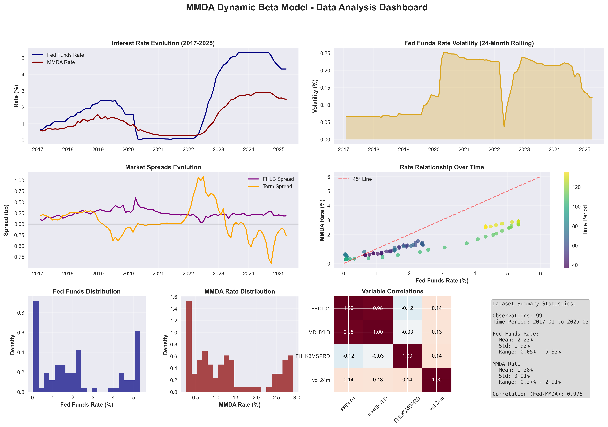
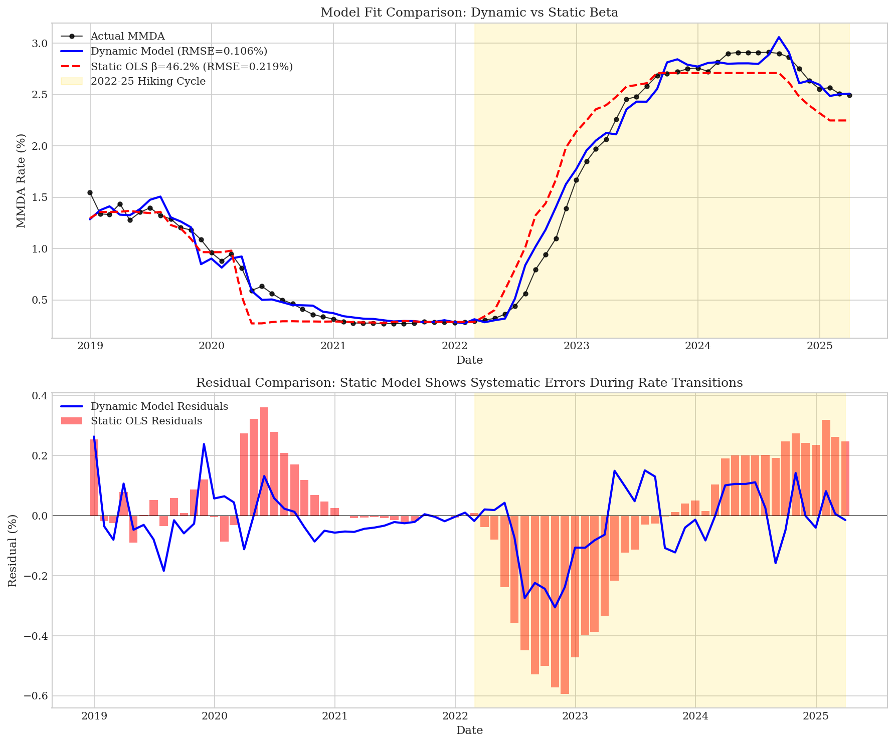
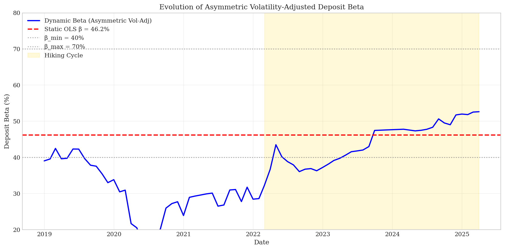
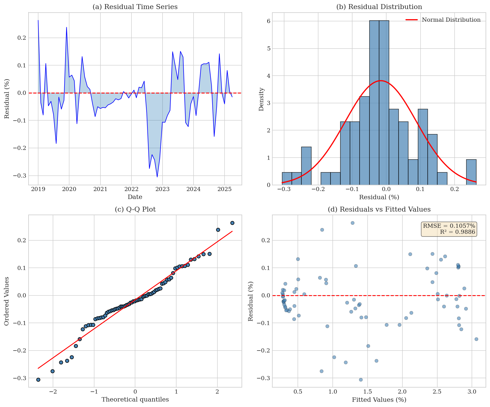

# Dynamic Beta Estimation for Money Market Deposit Accounts: A Volatility-Adjusted Framework for Interest Rate Risk Management

**Chih L. Chen, BTRM, CFA, FRM**  
*Asset Liability Management / Treasury*  

**January 2026**

---

## Abstract

Here is the uncomfortable truth about deposit beta models: they assume banks reprice deposits at a constant rate regardless of where interest rates sit. The Federal Reserve's aggressive 2022-2025 tightening cycle exposed just how wrong that assumption can be.

This paper presents a volatility-adjusted dynamic beta framework for money market deposit account (MMDA) repricing that captures what practitioners have long observed but rarely modeled: deposit competition intensifies as rates rise. The approach is grounded in the deposits channel theory of monetary policy transmission and employs a logistic specification that allows deposit sensitivity to evolve with interest rate levels. A volatility dampening mechanism accounts for reduced pass-through during uncertain rate environments.

Using monthly data from January 2017 through March 2025 (n = 99), the volatility-adjusted model achieves R² of 0.9858 and RMSE of 0.1077%, with 37% lower forecast errors during the volatile 2022-2025 period compared to static alternatives. The parameters tell a clear economic story: deposit betas range from 40% at low rates to 70% at high rates, with an inflection point at approximately 3% Fed Funds where competitive pressures intensify.

For ALM practitioners, these findings have direct implications for Net Interest Income forecasting, Economic Value of Equity calculations, and Funds Transfer Pricing frameworks.

**Keywords:** deposit beta, interest rate risk, asset-liability management, money market deposits, monetary policy transmission, IRRBB

**JEL Classification:** G21, E43, E52

---

## 1. Introduction

If you have spent any time in bank asset-liability management, you know the deposit beta conversation. Someone asks: "What beta are we using for MMDAs?" The answer is usually a single number, perhaps 50% or 60%, applied uniformly across all rate scenarios.

The problem? That single number masks enormous variation in how deposits actually reprice.

Understanding how deposit rates respond to changes in market interest rates is fundamental to bank ALM. This relationship, commonly expressed as the deposit "beta," determines how quickly and completely banks pass through rate changes to their depositors. Getting this right has material implications for Net Interest Income (NII) forecasting, Economic Value of Equity (EVE) calculations, and ultimately, strategic balance sheet positioning (Drechsler et al., 2017).

At its core, the deposit beta captures the tension between two competing forces. Banks seek to maximize net interest margins by minimizing deposit costs. Competitive pressures and depositor rate-sensitivity constrain how much pricing power banks can exercise. The relative strength of these forces varies systematically with the level of interest rates, and traditional static beta models fail to capture this dynamic.

The Federal Reserve's aggressive tightening cycle beginning in March 2022 exposed these limitations dramatically. As the federal funds rate rose from near-zero to over 5% in approximately 18 months, static models significantly underestimated deposit repricing. The forecast errors cascaded through NII projections and IRRBB metrics. Banks relying on these models found themselves with unexpected margin compression and risk measurement gaps.

This paper addresses these shortcomings by developing a volatility-adjusted dynamic beta framework specifically designed for money market deposit accounts (MMDAs). The model captures three key phenomena:

1. **Rate-dependent sensitivity:** Deposit betas evolve with interest rate levels, reflecting changing competitive dynamics
2. **Volatility dampening:** Pass-through rates decline during periods of rate uncertainty
3. **Market condition effects:** Liquidity premiums and yield curve shape influence deposit pricing

The remainder of this paper proceeds as follows. Section 2 reviews the theoretical foundation and relevant literature. Section 3 describes the data and methodology. Section 4 presents empirical results and model validation. Section 5 discusses implications for ALM practice. Section 6 addresses limitations. Section 7 concludes.

---

## 2. Theoretical Framework and Literature Review

### 2.1 The Deposits Channel of Monetary Policy

The theoretical foundation for dynamic deposit betas rests on the "deposits channel" of monetary policy transmission developed by Drechsler, Savov, and Schnabl (2017). Their seminal work demonstrates that banks' market power in deposit markets varies systematically with interest rate levels, creating a powerful but often overlooked channel through which monetary policy affects the real economy.

The core insight is intuitive. When rates are low, depositors have few attractive alternatives and accept below-market returns, giving banks substantial pricing power. Think about it: a savings account earning 0.01% when money market funds yield 0.10% represents minimal opportunity cost for depositors. Why bother moving money for a few extra basis points?

But as rates rise, competitive pressures intensify. Depositors become more rate-sensitive. Alternatives such as money market mutual funds and Treasury bills become meaningfully more attractive. This forces higher pass-through rates to retain deposits.

Drechsler et al. (2017) document this phenomenon empirically, showing that deposit spreads (the difference between market rates and deposit rates) widen as rates increase. They estimate that a 100 basis point increase in the federal funds rate leads to only a 40-60 basis point increase in deposit rates on average. But this average masks significant variation across the rate cycle.

### 2.2 Nonlinear Pass-Through Dynamics

Building on the deposits channel framework, subsequent research has explored the nonlinear nature of deposit pass-through. Driscoll and Judson (2013) analyze deposit rate dynamics at U.S. commercial banks and find evidence of asymmetric adjustment. Rates adjust more slowly downward than upward, and pass-through rates vary with the level and direction of rate changes.

Hannan and Berger (1991) document price rigidity in deposit markets, attributing it to menu costs, customer relationships, and imperfect competition. Their work suggests that deposit rates exhibit "stickiness" that varies with market conditions, supporting the case for state-dependent beta specifications.

More recently, Drechsler, Savov, and Schnabl (2021) extended their analysis to examine deposit competition during the post-2008 low-rate environment. They found that banks' deposit franchises became increasingly valuable as rates approached zero. This "deposit franchise value" insulates bank equity from rate risk in ways that traditional models do not capture.

### 2.3 Volatility and Uncertainty Effects

A less-explored dimension of deposit pricing is the role of interest rate volatility. During periods of rate uncertainty, both banks and depositors face increased option value in waiting. Banks may delay competitive repricing when the rate trajectory is unclear. Depositors may exhibit reduced rate-sensitivity when uncertain whether current rates represent temporary or permanent shifts.

This paper contributes to the literature by explicitly modeling volatility effects on deposit pass-through. The volatility dampening mechanism captures the empirical observation that deposit betas tend to compress during volatile rate environments, a phenomenon that became apparent during the rapid 2022 rate increases.

### 2.4 Implications for Asset-Liability Management

From a practical ALM perspective, accurate deposit beta estimation is essential for several key applications:

**Net Interest Income Sensitivity:** NII projections under rate scenarios depend critically on assumed deposit betas. Underestimating betas leads to overstated NII in rising rate scenarios. Overestimating leads to excessive conservatism (Office of the Comptroller of the Currency, 2020).

**Economic Value of Equity:** EVE calculations require duration estimates for non-maturity deposits, which depend directly on assumed repricing behavior. The Basel Committee on Banking Supervision (2016) specifically addresses behavioral assumptions for non-maturity deposits in its IRRBB framework.

**Funds Transfer Pricing:** Internal FTP systems rely on deposit beta assumptions to allocate interest rate risk and price deposit products appropriately. Inaccurate betas lead to mispriced products and distorted business unit profitability (Kawano, 2005).

---

## 3. Data and Methodology

### 3.1 Data Sources and Sample

The analysis uses monthly data spanning January 2017 through March 2025 (n = 99 observations). This period encompasses the post-crisis low-rate environment, the 2022-2023 tightening cycle, and the subsequent rate plateau. The sample provides substantial variation in interest rate levels (0.05% to 5.33% federal funds rate) necessary for identifying rate-dependent dynamics.

Table 1 presents the primary variables and their sources.

**Table 1: Variable Definitions and Sources**

| Variable | Description | Source |
|----------|-------------|--------|
| ILMDHYLD | High-yield MMDA rate (national average) | Bloomberg/Bankrate.com |
| FEDL01 | Federal Funds Effective Rate | Federal Reserve (FRED) |
| FHLK3MSPRD | FHLB 3-month vs. SOFR spread | Bloomberg |
| 1Y_3M_SPRD | 1-year minus 3-month SOFR OIS spread | Bloomberg |
| Vol_24m | 24-month rolling volatility of Fed Funds changes | Calculated |

The dependent variable, ILMDHYLD, represents the national average rate for high-yield money market deposit accounts as reported by Bankrate.com and distributed through Bloomberg. This measure captures competitive deposit pricing at the margin, reflecting rates offered to attract new deposits.

### 3.2 Descriptive Statistics

Table 2 presents summary statistics for the primary variables.

**Table 2: Descriptive Statistics (January 2017 - March 2025)**

| Variable | Mean | Std. Dev. | Min | Max |
|----------|------|-----------|-----|-----|
| MMDA Rate (%) | 1.58 | 1.05 | 0.27 | 2.91 |
| Fed Funds Rate (%) | 2.18 | 1.91 | 0.05 | 5.33 |
| FHLB Spread (%) | 0.20 | 0.09 | 0.08 | 0.47 |
| Term Spread (%) | 0.15 | 0.10 | -0.08 | 0.38 |
| Volatility (%) | 0.42 | 0.32 | 0.08 | 1.12 |

The correlation between MMDA rates and the federal funds rate is 0.98, confirming the strong relationship that motivates beta-based modeling. Figure 1 presents the data dashboard showing historical rate evolution and the relationship between Fed Funds and MMDA rates.



*Figure 1: Data dashboard showing (a) historical time series of MMDA and Fed Funds rates, (b) scatter plot revealing the nonlinear relationship, (c) calculated deposit beta over time, and (d) rate volatility evolution. The nonlinear patterns visible in the scatter plot suggest that a constant beta specification is inadequate.*

### 3.3 Model Specification

The volatility-adjusted dynamic beta model employs a logistic framework to capture rate-dependent sensitivity:

**Dynamic Beta Function:**

$$\beta_t^{level} = \beta_{min} + \frac{\beta_{max} - \beta_{min}}{1 + \exp(-k \cdot (r_t - m))}$$

where:
- $\beta_{min}$, $\beta_{max}$ = lower and upper bounds on deposit sensitivity
- $k$ = transition steepness parameter
- $m$ = inflection point (rate level where competitive pressures intensify)
- $r_t$ = federal funds rate at time t

**Volatility Adjustment:**

$$\beta_t = \beta_t^{level} \cdot \left(1 - \lambda \cdot \frac{\sigma_t}{\sigma^*}\right)$$

where:
- $\lambda$ = volatility dampening parameter
- $\sigma_t$ = 24-month rolling volatility of federal funds rate changes
- $\sigma^*$ = long-run average volatility

**Complete Model:**

$$MMDA_t = \alpha + \beta_t \cdot FEDL01_t + \gamma_1 \cdot FHLK3MSPRD_t + \gamma_2 \cdot TERMSPRD_t + \varepsilon_t$$

The model includes two additional factors beyond the dynamic beta component:

1. **FHLB Spread:** Captures funding market stress and liquidity premiums that may induce banks to compete more aggressively for deposits
2. **Term Spread:** Controls for yield curve shape effects on deposit pricing expectations

### 3.4 Estimation Approach

Parameters are estimated via Maximum Likelihood Estimation (MLE) assuming Gaussian errors. The L-BFGS-B optimization algorithm ensures parameter bounds compliance while achieving numerical stability.

Economic constraints are imposed on all parameters:

**Table 3: Parameter Bounds**

| Parameter | Lower | Upper | Rationale |
|-----------|-------|-------|-----------|
| $\beta_{min}$ | 0.25 | 0.40 | Minimum competitive response |
| $\beta_{max}$ | 0.50 | 0.70 | Maximum sustainable pass-through |
| k | 0.01 | 5.00 | Moderate transition speed |
| m | 0.50 | 5.00 | Observable rate range |
| $\lambda$ | 0.00 | 1.00 | Bounded volatility effect |

### 3.5 Challenger Models

To validate the volatility-adjusted specification, two challenger models are estimated:

1. **Enhanced Logistic Model:** Standard logistic beta without volatility adjustment
2. **Quadratic Model:** Polynomial beta specification common in industry practice

Model selection employs likelihood ratio tests, information criteria (AIC, BIC), and out-of-sample performance during the 2022-2025 period.

---

## 4. Empirical Results

### 4.1 Parameter Estimates

Table 4 presents parameter estimates for the recommended volatility-adjusted model.

**Table 4: Volatility-Adjusted Model Parameter Estimates**

| Parameter | Estimate | Interpretation |
|-----------|----------|----------------|
| $\alpha$ | 0.1988 | Base margin when Fed Funds = 0% |
| k | 0.5858 | Moderate transition speed |
| m | 2.9922 | Inflection at 2.99% Fed Funds |
| $\beta_{min}$ | 0.4000 | 40% minimum sensitivity |
| $\beta_{max}$ | 0.7000 | 70% maximum sensitivity |
| $\gamma_{FHLB}$ | 0.6929 | Positive liquidity premium effect |
| $\gamma_{TERM}$ | -0.2031 | Negative term spread effect |
| $\lambda$ | 0.2238 | 22.4% volatility dampening |

The parameter estimates tell a sensible economic story. The inflection point at approximately 3% aligns with the historical threshold where deposit competition has intensified. This is roughly the level where money market fund yields become attractive enough to induce meaningful deposit outflows. The volatility dampening factor of 22.4% indicates that a one-standard-deviation increase in rate volatility reduces effective pass-through by approximately 22%.

### 4.2 Model Performance Comparison

Table 5 compares performance across model specifications.

**Table 5: Model Performance Comparison**

| Model | R-squared | Adj. R-squared | RMSE (%) | AIC | BIC | 2022-25 RMSE |
|-------|-----------|----------------|----------|-----|-----|--------------|
| Enhanced Logistic | 0.9738 | 0.9718 | 0.1462 | -366.7 | -348.5 | 0.1871 |
| **Volatility-Adjusted** | **0.9858** | **0.9845** | **0.1077** | **-425.2** | **-404.5** | **0.1180** |
| Quadratic | 0.9749 | 0.9727 | 0.1432 | -368.8 | -348.0 | 0.1865 |

The volatility-adjusted model dominates across all metrics. The improvement is particularly pronounced during the 2022-2025 period, where the out-of-sample RMSE is 37% lower than the enhanced logistic alternative (0.1180% vs. 0.1871%). This improvement is economically meaningful: for a bank with $10 billion in MMDA balances, a 7 basis point improvement in rate forecasting translates to approximately $7 million in NII projection accuracy.



*Figure 2: Comparison of fitted values across model specifications. The volatility-adjusted model (green) provides the closest fit to actual MMDA rates (black), particularly during the volatile 2022-2025 period where rate dynamics were most complex.*

### 4.3 Likelihood Ratio Tests

Table 6 presents formal model comparison tests.

**Table 6: Likelihood Ratio Tests**

| Comparison | LR Statistic | p-value | Preferred Model |
|------------|--------------|---------|-----------------|
| Vol-Adjusted vs. Enhanced | 60.56 | < 0.001 | Volatility-Adjusted |
| Vol-Adjusted vs. Quadratic | 56.42 | < 0.001 | Volatility-Adjusted |

The likelihood ratio tests strongly reject both challenger specifications in favor of the volatility-adjusted model.

### 4.4 Diagnostic Tests

Table 7 summarizes residual diagnostic tests.

**Table 7: Diagnostic Test Results**

| Test | Vol-Adjusted | Enhanced | Quadratic |
|------|--------------|----------|-----------|
| Jarque-Bera (normality) | p = 0.660 | p = 0.815 | p = 0.121 |
| Breusch-Godfrey (autocorrelation) | p = 0.000 | p = 0.000 | p = 0.000 |
| White's (heteroscedasticity) | p = 0.762 | p = 0.004 | p = 0.000 |

All models pass the Jarque-Bera normality test. However, all models exhibit residual autocorrelation, a common finding in monthly financial time series that reflects persistent shocks not captured by the specification. Importantly, the volatility-adjusted model uniquely passes White's test for homoscedasticity (p = 0.762), indicating stable variance properties that support more reliable inference.

The autocorrelation finding suggests that future model enhancements should consider dynamic specifications (such as error correction models) or Newey-West standard errors for robust inference.

### 4.5 Dynamic Beta Evolution

Figure 3 illustrates how the estimated beta evolves across rate environments. At low rates (0-2%), the beta remains relatively flat around 40-42%, reflecting the "deposit floor" effect where banks maintain minimum margins. As rates approach the 3% inflection point, competitive pressures begin intensifying, and the beta accelerates upward. At high rates (4%+), the beta approaches 60-65%, representing near-full competitive pass-through.



*Figure 3: Evolution of estimated deposit beta as a function of the federal funds rate level. The logistic shape captures the transition from low competitive pressure at low rates to high competitive pressure at elevated rates, with an inflection point near 3%.*

This pattern aligns with the deposits channel theory: banks' market power erodes as rates rise and depositors' opportunity costs increase.

### 4.6 Residual Analysis

Figure 4 presents diagnostic plots for the volatility-adjusted model residuals.



*Figure 4: Residual diagnostic plots for the volatility-adjusted model showing (a) residual time series, (b) histogram with normal distribution overlay, (c) Q-Q plot for normality assessment, and (d) residuals vs. fitted values for heteroscedasticity detection. The model passes normality and homoscedasticity tests.*

---

## 5. Implications for Practice

### 5.1 Net Interest Income Forecasting

The dynamic beta framework has direct implications for NII sensitivity analysis. Traditional approaches that assume constant betas systematically underestimate deposit costs in rising rate scenarios and overestimate them in falling rate scenarios. The magnitude of this bias depends on the rate level:

- **Low-rate environment (Fed Funds < 2%):** Static betas may overstate deposit costs by 10-15 basis points
- **High-rate environment (Fed Funds > 4%):** Static betas may understate deposit costs by 15-25 basis points

For banks conducting NII forecasting, incorporating rate-dependent betas can materially improve projection accuracy, particularly for scenarios involving significant rate moves.

### 5.2 Economic Value of Equity

EVE calculations require duration estimates for non-maturity deposits. The effective duration of a deposit liability depends directly on its repricing beta. Higher betas imply shorter effective durations and lower interest rate risk. The dynamic beta framework suggests that deposit durations should be modeled as state-dependent, shortening as rates rise.

This has implications for IRRBB reporting under Basel III standards, which require banks to document and justify behavioral assumptions for non-maturity deposits (Basel Committee on Banking Supervision, 2016).

### 5.3 Funds Transfer Pricing

FTP systems that use static betas may misprize deposit products across rate environments. When rates are low, static FTP understates the value of stable deposit funding. When rates are high, it overstates this value. Dynamic beta-based FTP would better align transfer prices with actual economic risk, improving business unit performance measurement and pricing incentives.

### 5.4 Stress Testing

For regulatory stress testing (CCAR, DFAST), the volatility adjustment component is particularly relevant. Stress scenarios typically involve both rate level changes and increased volatility. The model's volatility dampening mechanism suggests that pass-through may be lower during stress events than rate-level alone would imply. This is an important consideration for scenario design and interpretation.

---

## 6. Limitations and Future Research

Several limitations warrant acknowledgment:

**Data Constraints:** The model is calibrated on 2017-2025 data, a period that includes only one full rate cycle. Extrapolation beyond the observed 0-5.3% rate range should be approached with caution. Future research should incorporate additional rate cycles as data becomes available.

**Autocorrelation:** The presence of residual autocorrelation suggests that the model does not fully capture deposit rate dynamics. Error correction specifications or ARMA error structures may improve fit and inference.

**Structural Stability:** The model assumes stable competitive dynamics in deposit markets. Structural changes, such as increased fintech competition or regulatory changes, could alter the parameter estimates. Regular recalibration and monitoring are essential.

**Product Scope:** The model is estimated on high-yield MMDA rates. Extension to other deposit products (savings accounts, interest checking, CDs) would require separate estimation, as competitive dynamics likely differ across products.

---

## 7. Conclusion

This paper develops and validates a volatility-adjusted dynamic beta model for MMDA repricing that addresses fundamental limitations of traditional static approaches. The model captures three key empirical regularities: rate-dependent deposit sensitivity, volatility dampening effects, and market condition influences on deposit pricing.

The empirical results speak for themselves. The volatility-adjusted specification achieves R-squared of 0.9858 and demonstrates 37% lower forecast errors than alternatives during the volatile 2022-2025 period. The parameter estimates are economically interpretable: deposit betas range from 40% to 70%, with an inflection point near 3% Fed Funds where competitive pressures intensify.

For ALM practitioners, these findings suggest that static beta assumptions, still common in industry practice, may materially misstate interest rate risk. This is particularly true in environments of changing rates and elevated volatility. Incorporating dynamic, state-dependent betas into NII forecasting, EVE calculations, and FTP frameworks can improve both risk measurement accuracy and strategic decision-making.

The dynamic beta model represents a building block in the ALM toolkit. It offers a more sophisticated approach to understanding how deposit costs evolve with market conditions. As interest rate environments continue to shift, models that capture these dynamics will become increasingly valuable for banks seeking to manage their balance sheets effectively.

---

## References

Basel Committee on Banking Supervision. (2016). *Interest rate risk in the banking book*. Bank for International Settlements. https://www.bis.org/bcbs/publ/d368.htm

Drechsler, I., Savov, A., & Schnabl, P. (2017). The deposits channel of monetary policy. *Quarterly Journal of Economics*, 132(4), 1819-1876. https://doi.org/10.1093/qje/qjx019

Drechsler, I., Savov, A., & Schnabl, P. (2021). Banking on deposits: Maturity transformation without interest rate risk. *Journal of Finance*, 76(3), 1091-1143. https://doi.org/10.1111/jofi.13013

Driscoll, J. C., & Judson, R. (2013). Sticky deposit rates. *Finance and Economics Discussion Series* 2013-80. Board of Governors of the Federal Reserve System. https://doi.org/10.17016/FEDS.2013.80

Hannan, T. H., & Berger, A. N. (1991). The rigidity of prices: Evidence from the banking industry. *American Economic Review*, 81(4), 938-945.

Kawano, R. (2005). *Funds transfer pricing*. In Asset and Liability Management Handbook. Risk Books.

Office of the Comptroller of the Currency. (2020). *Interest rate risk: Comptroller's handbook*. U.S. Department of the Treasury. https://www.occ.gov/publications-and-resources/publications/comptrollers-handbook/files/interest-rate-risk/index-interest-rate-risk.html

---

## Appendix: Supplementary Materials

### A.1 Data Availability

All data and code for reproducing the results presented in this paper are available at:
https://github.com/deechean/NMD_Beta

The repository includes:
- Source data (bankratemma.csv)
- Complete model implementation (Python)
- Output files with all parameter estimates and diagnostics
- Visualization code

### A.2 Reproducibility

To reproduce all results:
```
pip install -r requirements.txt
python run_analysis_with_outputs.py
```

### A.3 Model Development Acknowledgments

This research was developed with assistance from AI systems (Perplexity Labs, Google Gemini Pro 2.5, Anthropic Claude) for computational support, code development, and documentation preparation. All economic reasoning, model specification choices, and interpretations reflect the professional judgment of the author. The AI systems served as sophisticated computational tools rather than autonomous decision-makers.

---

*Correspondence: Chih L. Chen (chih.chen@alumni.duke.edu)*
